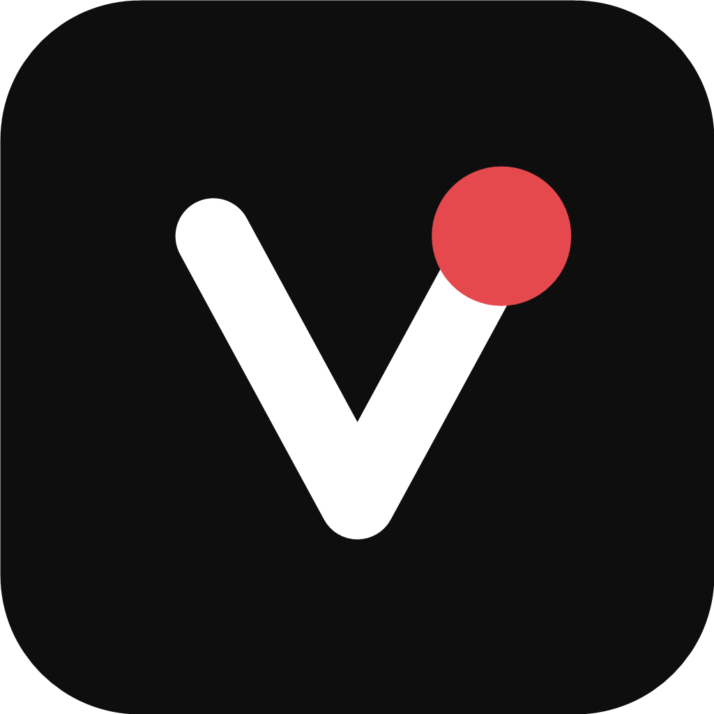
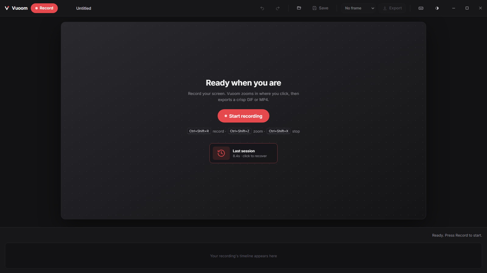
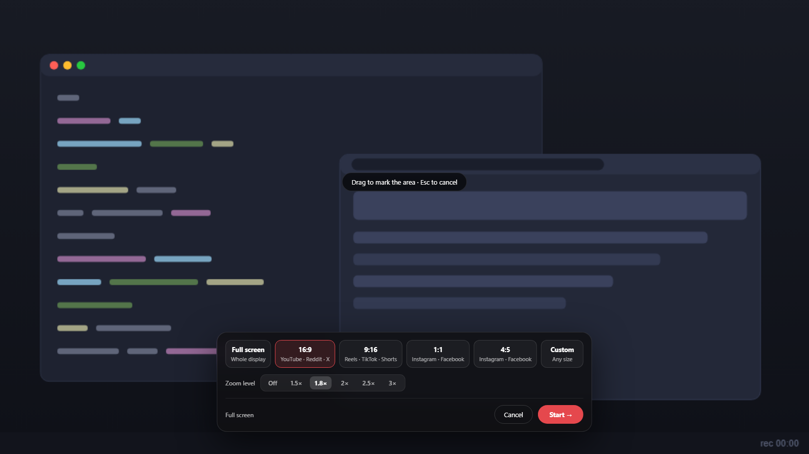

<div align="center">



# Vuoom

**Screen recordings that zoom where it matters.**

A **free, open-source screen recorder for Windows** with cinematic **auto-zoom**.
Record your screen, the camera glides into the action, and you export a small,
crisp **demo GIF or MP4** ready for your GitHub README, changelog, Slack, or
product post. No account, no watermark, no subscription.

[](https://github.com/Razee4315/Vuoom/releases/latest)
[](https://github.com/Razee4315/Vuoom/releases)
[](https://github.com/Razee4315/Vuoom/actions/workflows/ci.yml)
[](./LICENSE)


</div>

---

## Why Vuoom?

A flat recording of your whole screen makes UI text tiny and the "wow" moment
invisible. The tools that fix this, the ones that smoothly zoom into each click
like a little camera operator (Screen Studio and friends), are **Mac-only, paid,
or both**. Vuoom is that experience as a free Screen Studio alternative for
Windows, in a small native app:

**Record, zoom happens where you point, cut the dead air, export a GIF or MP4
you can paste anywhere.**

## A redesigned experience

The whole interface was rebuilt around one idea: a quiet, focused editor that
stays out of your way until you need it.

| | |
|---|---|
|  |  |
| **Home that helps.** A calm hero, one big Record button, crash recovery, and your recent projects on a card grid. | **Framing first.** Frozen-desktop region picking with social presets, live pixel dimensions, and zoom strength before you start. |
|  |  |
| **Export without a wizard.** Format and presets on one card, honest size estimates, live progress, then copy or reveal. | **Five themes, re-tuned.** Black and white first, plus Graphite, Paper and Midnight. No purple anywhere. |

## Features

- 🎥 **Native capture**: Windows Graphics Capture at full resolution, full
  screen or a region (16:9 / 9:16 / 1:1 / 4:5 presets for social-ready
  framing). A red frame shows exactly what is being recorded (and never appears
  in it). Works on **any monitor** and you can **pause/resume** mid-take.
- 🔍 **Cinematic zoom**: press `Ctrl+Shift+Z` while recording to glide the
  camera into your cursor (and again to pull back out). Critically damped
  spring motion, never a hard cut, never shows off-screen area. In the editor,
  every zoom is **aimable**: follow the cursor, or drag a crosshair to lock
  onto one spot.
- 🎞️ **A real editor, not a video NLE**: timeline with a ruler, playhead and
  drag-to-scrub; **trim** handles; **cut out** the middle bits you don't want;
  **zoom blocks** you can move, resize, re-level, add (hover the lane for the
  click-to-add ghost) or delete; **"Skim idle"** that plays dead stretches at
  2 to 8x, plus manual speed regions; **undo/redo** across everything.
- ✏️ **Annotations**: text labels (bold/italic, color presets, six bundled
  display fonts), arrows, lines, boxes and ellipses with fill/thickness
  controls. Each one gets its own timeline lane: drag to control when (and how
  long) it shows, `Ctrl+D` to duplicate.
- 👆 **Demo polish, baked in**: **click ripples** at every recorded mouse
  click, a **keystroke overlay** that shows shortcuts like `Ctrl+C` as chips
  (plain typing is never shown, so passwords can't leak), and **Subtle / Studio
  frame presets** with seven backdrop gradients.
- 📦 **Export GIF or MP4**: optimized GIF for READMEs (with a **live size
  estimate**), or H.264 MP4 up to 60 fps for Slack / X / YouTube, encoded by
  Windows itself, no ffmpeg. One-click **Copy** pastes the file anywhere.
- 💾 **Projects and crash recovery**: save everything as a `.vuoom` bundle;
  frames stream to disk while recording, so length isn't capped by RAM, and a
  crash or accidental close offers **"Recover last session"** on the next
  launch. Recent projects wait on the home grid.
- 🎨 **Five clean themes**, toasts for every action, keyboard-first editing
  with a cheat sheet under `?`, and zero purple.
- 🪶 **Lightweight**: Tauri + Rust, not Electron. The webview is just the
  cockpit; capture, compositing (wgpu) and encoding all run natively.

## Quick start

1. **[Download](https://github.com/Razee4315/Vuoom/releases/latest)** the
   `.msi` (recommended) or `.exe` installer.
   > Builds are not yet code-signed: SmartScreen will warn. Click
   > *More info, then Run anyway*.
2. Press **Record**, frame your shot, hit **Start**.
3. While recording: `Ctrl+Shift+Z` to zoom in/out, **Pause** if you need a
   beat, `Ctrl+Shift+X` to stop.
4. Trim the ends, cut the fumbles, skim the idle parts, drop a text label or
   arrow, toggle click ripples.
5. **Export**, choose GIF or MP4, **Copy**, paste it wherever the demo goes.

## Keyboard shortcuts

| Shortcut | Action |
|---|---|
| `Ctrl+Shift+R` | Start the record flow |
| `Ctrl+Shift+Z` | Zoom in / out at the cursor (while recording) |
| `Ctrl+Shift+X` | Stop recording (global) |
| `Space` | Play / pause |
| `←` / `→` | Scrub the playhead (`Shift` = 1s jumps, `Home`/`End` = trim bounds) |
| `Z` / `X` / `C` | Insert a zoom / speed region / cut at the playhead |
| `V` `T` `A` `L` `S` `H` | Select, Text, Arrow, Line, Shape, Highlight tools |
| Arrow keys | Nudge the selected annotation (`Shift` = bigger steps) |
| `Ctrl+Z` / `Ctrl+Y` | Undo / redo any edit |
| `Ctrl+D` | Duplicate the selected annotation |
| `Delete` | Remove the selected annotation, zoom, speed region, or cut |
| `Ctrl+S` / `Ctrl+O` | Save / open a project |
| `Ctrl+E` | Export GIF / MP4 |
| `?` | Keyboard cheat sheet |

## How it's built

```
SolidJS + Vite (editor UI)  <-WebSocket preview-  Rust engine
                                                  |- vuoom-capture   Windows Graphics Capture (any monitor)
                                                  |- vuoom-input     global input log (QPC-stamped)
                                                  |- vuoom-zoom      auto-zoom planner + spring camera
                                                  |- vuoom-render    wgpu compositor (zoom, text, shapes, overlays)
                                                  |- vuoom-encode    GIF encoding + size estimation
                                                  |- vuoom-project   .vuoom project model (undo-able edits)
                                                  `- app shell       MP4 (Media Foundation), disk-backed
                                                                     frame store + crash recovery
```

The same `render(t)` path drives scrubbing **and** export, so what you preview
is exactly what ships. While recording, frames stream straight to disk: clip
length is bounded by your drive, not your RAM. Design docs live in
[`docs/`](./docs), including the [redesign blueprint](docs/AUDIT-AND-REDESIGN.md).

## Building from source

```sh
pnpm install
pnpm tauri dev      # run locally
pnpm tauri build    # produce installers
```

### Working on the UI without building Rust

The frontend ships with a browser mock of the engine, so you can run the whole
interface in a plain browser (handy on low-end machines):

```sh
pnpm dev            # then open the printed localhost URL with ?mock=1
```

Useful mock URL flags: `?mock=1` (force the mock), `&demo=1` (load a sample
take), `&export=1` (open export), `&record=1` (jump to the region selector),
`&theme=graphite` (force a theme). The mock is dev-only; the packaged app never
uses it.

Releases are built and published by [GitHub Actions](.github/workflows/release.yml)
on every push to `main`; CI runs typecheck, Biome, clippy (deny warnings), and
the full Rust test suite.

## License

[Apache-2.0](./LICENSE). Free for everyone, forever. That's the point.
